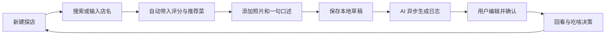

# 吃货达人 APP PRD

## 1. 产品概述

### 1.1 产品一句话

吃货达人是一款移动优先的 AI 美食日志 App，让探店爱好者用照片、少量字段和一句口述，沉淀小巷子里的美食地点、招牌必点、踩雷记录，以及美食背后的故事。

### 1.2 目标平台

- iPhone 原生 App
- 推荐 iOS 17 及以上
- 第一版单机可用，本地优先
- 推荐技术栈：SwiftUI、SwiftData、PhotosUI、MapKit/CoreLocation、Speech/AVFoundation、后台任务

### 1.3 MVP 原则

- 先做好个人记录、AI 生成和回看决策，不做社区。
- 新建记录必须轻，30 秒内能完成核心字段和照片录入。
- 自动信息可以失败，但用户记录不能丢。
- AI 生成结果必须可编辑、可重试、可保存历史草稿。
- 地点隐私默认保护，避免暴露精确位置。

## 2. 用户与场景

### 2.1 目标用户

- 高频探店爱好者：喜欢记录小店、苍蝇馆子、隐藏菜单。
- 城市漫游型吃货：常按街区、口味、价格、氛围回忆吃什么。
- 内容沉淀型用户：照片很多，但缺少结构化记录和可回看的故事。

### 2.2 核心问题

- 吃过的店散落在相册、聊天记录和点评收藏里，难以回看。
- 当下记录太麻烦，过后又忘了菜名、口味和感受。
- 再次选择吃什么时，缺少自己的可信记录。
- 用户想保留小店位置，但不希望精确坐标被默认展示或泄漏。

## 3. 产品目标与非目标

### 3.1 产品目标

1. 30 秒内新建一条含店名、美食类型、评分、推荐菜、照片的探店记录。
2. 自动带入大众点评和高德扫街榜相关评分、网友推荐菜 TOP3，失败时支持手动补充。
3. 基于照片、字段和一句口述异步生成可编辑 AI 美食日志。
4. 通过回看、筛选和智能推荐，帮助用户解决“不知道吃啥”和“想吃某类餐食”的选择问题。

### 3.2 第一版不做

- 不做社区、关注、点赞、评论、公开主页。
- 不做商家入驻、团购、优惠券、交易闭环。
- 不做复杂多人协作。
- 不依赖服务端才能完成记录。

## 4. 核心循环

## 5. MVP 功能范围

### 5.1 首页：美食日志流

首页默认展示个人美食卡片流。

核心能力：

- 按最近记录倒序展示。
- 卡片显示首图、店名、美食类型、评分、推荐菜、AI 摘要、是否踩雷。
- 支持搜索店名、菜名、口味关键词、街区。
- 支持快捷筛选：想吃辣、想吃面、一个人吃、朋友聚餐、便宜好吃、再去、踩雷。
- 空状态引导用户创建第一条探店。

视觉方向：

- 卡片以食物照片为第一视觉。
- 使用暖色点缀，但整体避免过度餐饮模板化。
- 重点突出“这家值不值得再去”和“必点是什么”。

### 5.2 新建探店

入口：

- 首页右下角主按钮。
- 相册分享入口，后续版本可支持。

流程：

1. 添加照片。
2. 输入或搜索店名。
3. 自动补全店铺信息。
4. 选择美食类型。
5. 确认评分、推荐菜 TOP3。
6. 录入一句口述或文字点评。
7. 保存记录并触发 AI 生成。

必须字段：

- 店名
- 美食类型
- 评分
- 推荐菜，至少 1 个，最多 3 个默认展示
- 至少 1 张照片

可选字段：

- 价格区间
- 街区
- 就餐时间
- 就餐人数
- 是否再去
- 是否踩雷
- 口味标签，如鲜、辣、甜、咸、油、清爽、锅气足
- 场景标签，如夜宵、约会、独食、朋友聚餐、带父母

### 5.3 店铺信息自动带入

数据来源：

- 大众点评：评分、用户推荐菜、榜单信息。
- 高德扫街榜：榜单标签、评分或热度、地理信息。

第一版建议：

- 产品层面保留“自动带入”能力。
- 工程实现允许先接可用 API 或半自动数据源。
- 自动失败时，所有字段必须可以手动填写。
- UI 上标识字段来源：自动带入、用户手动、用户修改。

字段策略：

| 字段 | 自动填充 | 手动兜底 | 备注 |
| --- | --- | --- | --- |
| 店名 | 是 | 是 | 支持模糊搜索和直接输入 |
| 地址/街区 | 是 | 是 | 默认展示街区，不默认展示精确地址 |
| 评分 | 是 | 是 | 可记录来源 |
| 推荐菜 TOP3 | 是 | 是 | 用户可新增、删除、排序 |
| 榜单标签 | 是 | 否 | 无数据时隐藏 |
| 经纬度 | 是 | 否 | 本地保存，展示时默认模糊化 |

### 5.4 照片记录

核心能力：

- 支持从相册选择多张照片。
- 支持拍照添加。
- 第一张默认为封面，可更换。
- 照片按 1、2、3、4+ 自适应排版。
- 本地保存原图引用或压缩副本，避免记录丢失。

照片失败策略：

- 选择照片后立即创建本地草稿。
- 照片处理失败时保留文本字段。
- 压缩失败时保留原始资源引用，并提示稍后重试。

### 5.5 一句口述和点评

输入方式：

- 语音转文字。
- 直接输入文字。

建议占位文案：

- “这家最惊喜的是？”
- “有什么必点或避雷？”
- “适合什么时候再来？”

口述内容用于：

- 生成 AI 日志。
- 提取口味标签、情绪标签、必点/踩雷信息。
- 搜索和回看。

### 5.6 AI 美食日志

生成触发：

- 记录保存后自动异步生成。
- 用户可手动重试。
- 用户可在编辑页重新生成。

输入上下文：

- 店名
- 美食类型
- 评分
- 推荐菜
- 用户口述
- 图片描述，第一版可选，若没有图像理解则仅使用照片数量和封面信息
- 场景标签
- 是否再去/是否踩雷

输出结构：

- 标题
- 60-120 字美食日志正文
- 必点菜总结
- 踩雷提醒
- 适合场景
- 下次再吃建议

编辑要求：

- AI 输出进入可编辑文本框。
- 未确认前标记为“AI 草稿”。
- 用户编辑后保存为正式日志。
- 保留原始用户口述，不被 AI 内容覆盖。

推荐文案风格：

- 有生活感，但不油腻。
- 像朋友写给未来自己的吃饭备忘。
- 少用夸张营销词，多写具体口感、场景和取舍。

示例：

> 巷口这家牛肉粉比门脸看起来认真。汤底不厚重，但牛肉香很稳，辣油后劲明显。推荐先点招牌牛肉粉，再加一份卤蛋。适合工作日一个人快速吃，也适合晚上不知道吃什么时回来兜底。下次可以试试干拌版本。

### 5.7 回看与“吃啥”决策

回看入口：

- 首页搜索。
- 筛选标签。
- “今天吃啥”按钮。

决策能力：

- 按美食类型推荐：面、粉、火锅、烧烤、咖啡、甜品等。
- 按场景推荐：一个人、两个人、朋友聚餐、下班后、夜宵。
- 按距离或街区推荐，默认模糊位置。
- 按“再去”优先级推荐。
- 排除踩雷记录。

第一版推荐逻辑：

- 本地规则优先，不依赖云端模型。
- 用户选择条件后，从本地记录中按评分、再去、最近未吃、标签匹配进行排序。
- 若记录不足，提示继续沉淀，而不是伪造推荐。

## 6. 信息架构

主要导航：

- 日志：首页卡片流
- 吃啥：条件推荐和随机选择
- 地图：可选 MVP 后段能力，默认模糊展示
- 设置：隐私、AI、数据备份

第一版建议使用 2 个主 Tab：

- 日志
- 吃啥

原因：

- MVP 聚焦记录和回看决策。
- 地图可以从详情页和筛选中进入，不必一开始占主导航。

## 7. 关键页面

### 7.1 首页

模块：

- 顶部搜索框
- 快捷筛选胶囊
- 美食卡片流
- 新建按钮

卡片信息：

- 封面照片
- 店名
- 美食类型
- 评分
- 推荐菜 TOP3
- AI 日志摘要
- 标签：再去、踩雷、夜宵、独食等

### 7.2 新建页

布局建议：

- 顶部照片区，占据第一屏上半部分。
- 下方为快速字段表单。
- 店名和照片优先级最高。
- 评分与推荐菜支持自动填充加载态。
- 底部固定保存按钮。

离线/失败提示：

- “已先保存到本地，信息补全稍后继续。”
- “推荐菜没有拉到，可以先手动写。”
- “AI 日志正在生成，你可以先离开。”

### 7.3 详情页

模块：

- 照片拼贴
- 店名、街区、美食类型、评分
- 推荐菜
- AI 日志正文，可编辑
- 原始口述
- 再去/踩雷
- 隐私状态
- 重新生成 AI 日志

### 7.4 吃啥页

模块：

- 今日条件选择：类型、场景、预算、距离/街区、排除踩雷
- 推荐结果卡
- 换一个
- 为什么推荐：展示匹配原因

示例推荐理由：

- “你上次给了 4.7 分，并标了再去。”
- “这家适合独食，推荐菜里有你常点的牛肉粉。”
- “距离近，但默认只展示到街区。”

## 8. 数据模型

### 8.1 FoodLog

| 字段 | 类型 | 说明 |
| --- | --- | --- |
| id | UUID | 本地唯一 ID |
| createdAt | Date | 创建时间 |
| updatedAt | Date | 更新时间 |
| status | Enum | draft, saved, generating, generated, failed |
| shopName | String | 店名 |
| foodType | String | 美食类型 |
| rating | Double | 评分 |
| ratingSource | Enum | dianping, amap, manual, mixed |
| recommendedDishes | [Dish] | 推荐菜 |
| photos | [PhotoAsset] | 照片 |
| voiceNoteText | String | 口述转文字 |
| userComment | String | 用户手写点评 |
| aiTitle | String | AI 标题 |
| aiBody | String | AI 正文 |
| aiStatus | Enum | pending, generating, generated, failed, edited |
| tags | [String] | 标签 |
| revisitIntent | Enum | yes, maybe, no |
| isPitfall | Bool | 是否踩雷 |
| privacyLevel | Enum | hiddenExact, districtOnly, exact |
| district | String | 街区 |
| address | String | 地址，默认不展示 |
| latitude | Double? | 经纬度，本地保存 |
| longitude | Double? | 经纬度，本地保存 |

### 8.2 Dish

| 字段 | 类型 | 说明 |
| --- | --- | --- |
| id | UUID | 本地唯一 ID |
| name | String | 菜名 |
| source | Enum | auto, manual |
| rank | Int | 排序 |
| note | String | 用户备注 |

### 8.3 PhotoAsset

| 字段 | 类型 | 说明 |
| --- | --- | --- |
| id | UUID | 本地唯一 ID |
| localIdentifier | String | 相册资源 ID |
| localPath | String | App 沙盒副本路径 |
| isCover | Bool | 是否封面 |
| processingStatus | Enum | pending, ready, failed |

## 9. 隐私与安全

### 9.1 地点隐私默认保护

默认策略：

- 卡片和详情页默认只展示街区，不展示精确地址。
- 地图默认模糊到附近区域，不展示精确点。
- 分享导出默认移除经纬度和精确地址。
- 用户必须主动切换，才可展示精确地点。

隐私级别：

- 隐藏精确位置：默认。
- 仅显示街区：默认展示状态。
- 显示精确地址：用户主动开启。

### 9.2 本地优先

- 所有记录先写入 SwiftData。
- 照片先保存本地引用或副本。
- AI 生成和信息补全都不能阻塞本地保存。
- 未来如增加云同步，需要提供本地数据导出和删除能力。

## 10. 失败与离线体验

硬约束：记录失败不得丢数据。

策略：

- 新建页打开后即创建草稿 ID。
- 每次字段变化自动保存。
- 照片、评分、推荐菜、AI 生成分别独立状态管理。
- 断网时允许完整填写并保存。
- 自动补全失败不影响保存。
- AI 生成失败后保留记录，并显示重试按钮。
- App 被杀后再次进入，恢复未完成草稿。

草稿状态：

- 未完成草稿：首页顶部提示继续编辑。
- 已保存但待补全：详情页显示信息补全中。
- AI 失败：显示原始口述和手写点评，允许重新生成。

## 11. AI 生成要求

### 11.1 生成时机

- 用户保存记录后异步生成。
- 生成中用户可以离开页面。
- 生成完成后本地通知或页内状态更新。

### 11.2 可编辑要求

- AI 正文必须进入可编辑区域。
- 用户修改后状态变为 edited。
- 重新生成前提示会覆盖当前 AI 草稿，但不覆盖用户原始点评。

### 11.3 Prompt 方向

系统目标：

- 生成一篇给未来自己看的美食日志。
- 避免虚构不存在的菜、价格、地点细节。
- 不夸大，不营销化。
- 若用户标记踩雷，要明确写出避雷点。

输出约束：

- 标题不超过 18 字。
- 正文 60-120 字。
- 必点菜最多 3 个。
- 适合场景最多 3 个。

## 12. PO 验收标准

### 12.1 核心验收

在 30 秒内，新建一条记录并满足：

- 含美食店名。
- 含美食类型。
- 含评分。
- 含推荐菜。
- 含至少 1 张照片。
- 成功保存本地。
- 触发 AI 日志生成。
- AI 日志生成后可编辑。

### 12.2 失败验收

- 断网时仍可创建并保存记录。
- 自动评分拉取失败时可手动填写评分。
- 推荐菜拉取失败时可手动添加。
- AI 生成失败时记录不丢失，用户可重试或手写。
- App 中途退出后，草稿可恢复。

### 12.3 隐私验收

- 默认不展示精确经纬度。
- 分享内容默认不包含精确地址和经纬度。
- 用户主动打开精确位置后，才展示完整地址。

## 13. 指标

MVP 关注指标：

- 新建记录完成率。
- 新建记录平均耗时。
- AI 日志生成成功率。
- AI 日志编辑率。
- 草稿恢复成功率。
- 回看/吃啥页使用率。
- 推荐后打开详情率。

建议目标：

- 80% 用户可在 30 秒内完成核心记录。
- 自动补全失败时，手动兜底完成率不低于 70%。
- AI 日志生成后编辑率高于 30%，说明用户确实把 AI 当成可用草稿。

## 14. 版本规划

### V0.1 原型

- 首页卡片流
- 新建记录
- 本地保存
- 手动评分和推荐菜
- AI 日志生成模拟或接入
- 详情页编辑

### V0.2 MVP

- 大众点评/高德信息自动带入
- 失败兜底和草稿恢复
- 吃啥页本地推荐
- 地点隐私默认保护
- 照片拼贴优化

### V0.3 增强

- 语音输入优化
- 图片理解辅助生成
- 地图回看
- 数据导出
- iCloud 或私有云同步评估

## 15. 开放问题

- 大众点评与高德扫街榜的数据授权、API 可用性和合规路径需要确认。
- 第一版 AI 生成使用端侧模型、云端模型还是混合方案需要根据成本和隐私要求定。
- 照片保存策略需要在空间占用和防丢之间做取舍。
- 地图是否进入 MVP 主导航，需要根据原型测试决定。

